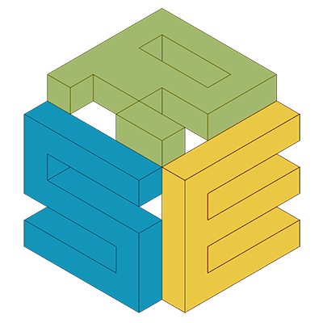

<div class="center">
    
    <h3>Yet another package manager!</h3>
</div>

<div class="right">
    
</div>

Will Furnass

Research Software Engineering team, University of Sheffield

2019-02-27

---


# Problem

  - Software infrequently exists in a vacuum


# Assumptions

Assumption: you want to work on / use software that has both:

  - Python bits
  - Non-Python bits

e.g.

  - use a Py pkg that depends on `libxml`;
  - use a Py pkg that depends on linear algebra C lib;
  - Mu, the BBC micro:bit IDE: depends on some Qt libraries for the GUI and serial comms.

---
# Requirements

When working on a Py + non-Py project we want:

  - To be able to use Py and non-Py pkgs and pkg versions you want, regardless of OS pkgs; 
  - Separation / independence from system packages to ensure/test portability; 
  - To work as an unprivileged user. 
  - For us and other users not to be tied to a given OS/environment. 

---
# Install everything as root using OS package manager?

  - Can only have one version of each pkg for all projects (no sandboxing)
  - Limited to older versions of pkgs
  - Limited selection of pkgs
  - May not be easy/possible to switch to Py3 (e.g. on Centos 7)

---
# Install Py stuff as root using pip?

  - Pro: newer Py pkgs
  - Con: Now using two pkg managers
       - Conflicts! 
       - May break your OS as many \*nix OS utilities written in Py 
       - How to keep Py and non-Py deps in sync? 
  - Con: No sandboxing 
  - Con:- Can only have one version of each package for all projects 
  - Con:- Slow to install if no wheel available and may need a compiler (urgh) 

# Install Py pkgs in virtualenv?

  - Pro: Newer Py pkgs  
  - Pro: Safer as no longer root  
  - Pro: Sandboxing of python pkgs - can have different vers per venv  
  - Con: Still using two pkg managers (OS for non-Py stuff) 
      - Pro: No conflicts and won't break your OS *but*
      - Con: How to keep Py and non-Py deps in sync? 
  - Con: Slow to install if no wheel available and may need a compiler (urgh) 

---
# Docker / Singularity?

  - Pro: Py and non-py pkgs contained
  - Con: Still using multiple packages internally if want latest Py pkgs
  - Con: How to track / maintain what is compatible?

---
# Another approach: Conda

Yet another package manager (groan) *but*:

  - A conda pkg can be pure Py (e.g. PyPI pkg with little extra md) 
  - *or* can be non-Py! 
  - Provides *environments* (like virtualenvs) 
      - Keep system and dev pkgs separate (even compiled libraries) 
      - Can do *everything* as unprivileged user 
      - Different pkgs and pkg versions per env 

---
  - Binary-only packages
      - Built for Windows (32b, 64b), macOS, Linux (32b, 64b) and 
      - for maj+min Py vers (+ maybe key dependency vers)
          - e.g. Binary pkg for Linux 64bit + Py 3.6 + `numpy` 1.12 
  - No reason not to use in Docker!

---
# Let's play...

  - Download **Miniconda** 3 installer from [https://repo.continuum.io/miniconda/](https://repo.continuum.io/miniconda/)
  - Run installer (using e.g. `sh miniconda-latest.sh` on macOS / Linux)
  - Install into default location (e.g. `~/miniconda3`) 
  - Do not prepend the Miniconda install location to your `PATH` 
  - Windows: do not add Miniconda Python to registry 

---
# Make conda available

  - **Windows**: Start a Miniconda shell from the *Start* menu. 
  - **Linux / macOS**: Ensure `conda` can be found on your `$PATH`:

```bash
export PATH="$HOME/miniconda3/bin:$PATH"
```

You should then be able to run:

```bash
[will@laptop ~]$ conda --version
conda 4.3.13
```

---
# Where am I? What's going on?

You are now in the *root* conda environment, which has its own Python install:

```
[will@laptop ~]$ which python
/home/will/miniconda3/bin/python
[will@laptop ~]$ python --version
Python 3.6.0 :: Continuum Analytics, Inc.
```

---
# Listing packages in a conda env

Small number of pkgs installed in root env:

```
[will@laptop ~]$ conda list
# packages in environment at /home/will/miniconda3:
#
cffi                      1.9.1                    py36_0  
conda                     4.3.11                   py36_0  
conda-env                 2.6.0                         0  
cryptography              1.7.1                    py36_0  
idna                      2.2                      py36_0  
libffi                    3.2.1                         1  
openssl                   1.0.2k                        0  
pip                       9.0.1                    py36_1  
pyasn1                    0.1.9                    py36_0  
pycosat                   0.6.1                    py36_1  
pycparser                 2.17                     py36_0  
pyopenssl                 16.2.0                   py36_0  
python                    3.6.0                         0  
readline                  6.2                           2  
requests                  2.12.4                   py36_0  
ruamel_yaml               0.11.14                  py36_1  
setuptools                27.2.0                   py36_0  
six                       1.10.0                   py36_0  
sqlite                    3.13.0                        0  
tk                        8.5.18                        0  
wheel                     0.29.0                   py36_0  
xz                        5.2.2                         1  
yaml                      0.1.6                         0  
zlib                      1.2.8                         3  
```

NB `requests` is Python, `zlib` is a compiled shared library!

---
# Creating a new environment

Best to create a new environment (distinct from the root) per project.
Need a name and some pkgs (optionally with version nums and build nums):

```console
[will@laptop ~]$ conda create --name room101 python=3.5 beautifulsoup4
Fetching package metadata ...........
Solving package specifications: .

Package plan for installation in environment /home/will/miniconda3/envs/room101:

The following NEW packages will be INSTALLED:

beautifulsoup4: 4.5.3-py35_0 
openssl:        1.0.2k-1     
pip:            9.0.1-py35_1 
python:         3.5.3-1      
readline:       6.2-2        
setuptools:     27.2.0-py35_0
sqlite:         3.13.0-0     
tk:             8.5.18-0     
wheel:          0.29.0-py35_0
xz:             5.2.2-1      
zlib:           1.2.8-3      
...
```

---
# *Activate* the environment...

...to start using it:

```bash
source activate room101
```

(omit '`source`' on Windows)

Your prompt now includes the name of your active environment:


```console
(room101) [will@laptop ~]$ which python
/home/will/miniconda3/envs/room101/bin/python
(room101) [will@laptop ~]$ python --version
Python 3.5.3 :: Continuum Analytics, Inc.
```

---
# Installing and removing packages

Try: 

  - installing the `numpy` package using `conda install PKGNAME` 
      - What is the dependency that also gets installed?
  - removing the `beautifulsoup4` package using `conda remove PKGNAME` 

Confirm the effect using `conda list`.

We can also install packages using **pip**:

  - Try installing the `mock` testing tool using pip then re-run `conda list`

---
# Less Py-centric environments

If conda pkgs don't have to be Py pkgs then we can use conda as a general purpose package manager e.g.

```console
(room101) [will@laptop ~]$ conda create --name piratical_fun r-base r-yaml
...
(room101) [will@laptop ~]$ source activate piratical_fun
...
(piratical_fun) [will@laptop ~]$ which R
/home/will/miniconda3/envs/piratical_fun/bin/R
(piratical_fun) [will@laptop ~]$ R
...
R version 3.3.2 (2016-10-31) -- "Sincere Pumpkin Patch"
...
> print("Arr!")
[1] "Arr!"
```

# Deactivating and deleting environments

> But we're supposed to be talking about Python!

Okay, let's deactivate and delete our R environment:

```console
(piratical_fun) [will@laptop ~]$ source deactivate
[will@laptop ~]$ conda env remove --name piratical_fun
```

NB as our environment is entirely contained within a directory we could just delete that instead:

```console
[will@laptop ~]$ rm -rf /home/will/miniconda3/envs/piratical_fun
```

---
# Auditing and reinstantiating environments

What if you want to share your environment with a friend?

Save the env state to a file:

```
[will@laptop ~]$ source activate room101
(room101) [will@laptop ~]$ conda env export > environment.yml
```

Then here or elsewhere:

```
[will@thecloud ~]$ conda env create --name my-room101
</code></pre>

These environment files are written in the *YAML* markup language.

They contain:

  - The installed conda packages (name, version, build) 
  - The installed pip packages (name, version) 
  - The used conda *channels* 

> WARNING: the list of packages is not just those explicitly installed.
> It can include OS-specific dependency packages so (unedited) environment files
> may not be as portable as you'd hope.

Task: Use `conda env export` to create and inspect an environment file 
for the `room101` environment.

===

You can also clone environments locally:

```bash
$ conda create --name room102 --clone room101
```

NB creating/cloning environments is cheap as conda (hard or soft) links to existing package installs in your *package cache* where possible.

---
# Ok, so what exactly is a package?

Each conda package is a tarball built from a *recipe*:

  - Build scripts for Windows and for macOS / Linux, 
    which typically contain little more than 

    ```bash
    $PYTHON setup.py install
    ```
  - A `meta.yml` file containing package metadata

Given these, `conda build` can compile/bundle packages and optionally upload them to a repository.

---
# Task

Visit [https://github.com/conda-forge/feedstocks/tree/master/feedstocks](https://github.com/conda-forge/feedstocks/tree/master/feedstocks)
and compare the build scripts and metadata files of:

  - `joblib`: a small Py package 
  - `matplotlib`: a large Py package that depends on some non-Py packages 
  - `make`: a small C program 

NB Not going to cover exactly how to build a package here; see the conda docs for info.

# What is Conda-Forge?

  - *Community-driven packaging* for Conda
  - Provides a separate *channel* to the default conda repository
  - Packages built using public Continuous Integration (CI) infrastructure
  - Propose a new recipe via 
    the [conda-forge/staged-recipes](https://github.com/conda-forge/staged-recipes)

---
  - If CI confirms that your pull request can build (on multiple OSs) then...
  - ...a dedicated *feedstock* repo is created for your recipe... 
  - and post-build your packages will be available from the conda-forge channel using e.g. 

    ```bash
    conda install -c conda-forge mynewpkg
    ```

---
# Challenge

Create a conda package for Mu ([https://github.com/mu-editor/mu](https://github.com/mu-editor/mu)), 
an IDE for the BBC micro:bit.

---
# Summary

  - Conda is a Python-centric but also general-purpose package manager 
  - Can separate projects using environments... 
  - ...can capture the state of an environment... 
  - ...and can recreate environments defined by others. 
  - Create packages for Python and non-Python software, 
  - then share your build recipes and packages with others using conda-forge 

**Thanks for listening!**
